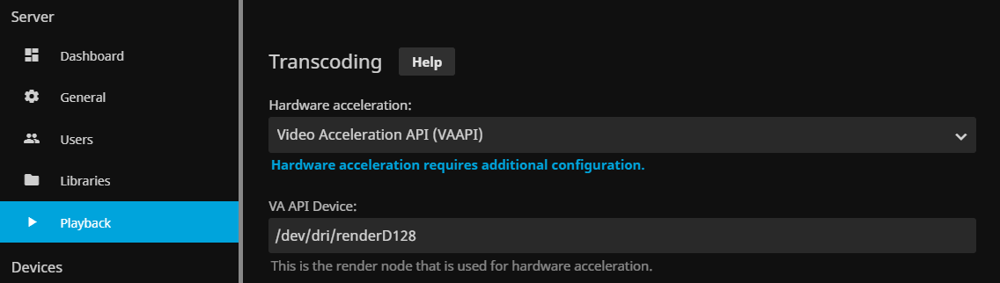
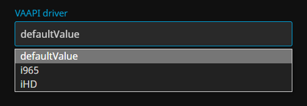

#  Jellyfin for QNAP &emsp; [].name&url=https%3A%2F%2Fapi.github.com%2Frepositories%2F441484865%2Freleases%3Fper_page%3D1&style=flat-square)].assets[0].download_count&url=https%3A%2F%2Fapi.github.com%2Frepositories%2F441484865%2Freleases%3Fper_page%3D1&logo=data:image/png;base64,iVBORw0KGgoAAAANSUhEUgAAACgAAAAoCAYAAACM/rhtAAAB5UlEQVRYR+2X/U3DMBDF6w3oBu0GMAEdASYANqAT0E5AmQA2oBvQDegGZAOyQXgvukTuyXFixxL+w5aqNLF9/uXdhx2zyLyZzPkWBXCuh4qC2SjYNM0VYL4E6N4YU82F4/xkLgbgM+y9CtQWgIecAfcA3BXAEAWUi4uCXvEkYxeIs7ob6FOQ4+2xIZ4JzmKB+8YiK/x6Vw4ByvOXtmQYswyBiyozAvhrLdRCugDVM065wdhzCGSwgjSOhVlCWlWk7XGlu7s6qO857AC4bQhclIJWzBGGxblrJ/zZyE2F68rqi4KbBShKakiXQNFwo4BwJRW5dqxawV3HCZA9nMfWGbaovrMNxqAjwLWBJxj+8EDacHcY9zkEgee9LT3GB/ij4kjPvdgt8EK2uy/cir5HTH73ANZDJcgJqEoJs/NNGWcSHHXxFRDWu1ZZu6GPKupwebBEWLqK+RRAxtva8/bRXYBmwe+g/w/QOswSpj8r5gS4A5hd2Nc8cecEaCcJY5qAdTaAUoq469wy4bq6lxWgK5NSAdL2KTpV/ROZNPwaZJuexeKSsUKdkjmsUAvgBtfuOzcljLbFpOFW1+7tuo2eBxEnrsNCSmBuBP2nQzBgSpIYW6MKxhhNOacAzlWzKFgUnKvA3Pl/bz0COFTcZNAAAAAASUVORK5CYII=&style=flat-square)](https://github.com/pdulvp/jellyfin-qnap/releases) [].name&url=https%3A%2F%2Fapi.github.com%2Frepositories%2F441484865%2Freleases%3Fper_page%3D2&style=flat-square)].assets[0].download_count&url=https%3A%2F%2Fapi.github.com%2Frepositories%2F441484865%2Freleases%3Fper_page%3D2&logo=data:image/png;base64,iVBORw0KGgoAAAANSUhEUgAAACgAAAAoCAYAAACM/rhtAAAB5UlEQVRYR+2X/U3DMBDF6w3oBu0GMAEdASYANqAT0E5AmQA2oBvQDegGZAOyQXgvukTuyXFixxL+w5aqNLF9/uXdhx2zyLyZzPkWBXCuh4qC2SjYNM0VYL4E6N4YU82F4/xkLgbgM+y9CtQWgIecAfcA3BXAEAWUi4uCXvEkYxeIs7ob6FOQ4+2xIZ4JzmKB+8YiK/x6Vw4ByvOXtmQYswyBiyozAvhrLdRCugDVM065wdhzCGSwgjSOhVlCWlWk7XGlu7s6qO857AC4bQhclIJWzBGGxblrJ/zZyE2F68rqi4KbBShKakiXQNFwo4BwJRW5dqxawV3HCZA9nMfWGbaovrMNxqAjwLWBJxj+8EDacHcY9zkEgee9LT3GB/ij4kjPvdgt8EK2uy/cir5HTH73ANZDJcgJqEoJs/NNGWcSHHXxFRDWu1ZZu6GPKupwebBEWLqK+RRAxtva8/bRXYBmwe+g/w/QOswSpj8r5gS4A5hd2Nc8cecEaCcJY5qAdTaAUoq469wy4bq6lxWgK5NSAdL2KTpV/ROZNPwaZJuexeKSsUKdkjmsUAvgBtfuOzcljLbFpOFW1+7tuo2eBxEnrsNCSmBuBP2nQzBgSpIYW6MKxhhNOacAzlWzKFgUnKvA3Pl/bz0COFTcZNAAAAAASUVORK5CYII=&style=flat-square)](https://github.com/pdulvp/jellyfin-qnap/releases)

##  Compatibility 
- See [Compatibility list](https://github.com/pdulvp/jellyfin-qnap/issues/4) and please add a comment if compatible or not with yours.
- Releases are created automatically from the latest jellyfin releases and are not field-tested nor official ones from Jellyfin or QNAP.
- The latest release with my :+1: is deployed on my QNAP and working properly.

##  Enable Video Acceleration in Jellyfin 

 ([中文](ScreenshotConfigCh.png))

Go to `Admin > Dashboard`
`Server > Playback`
- `Transcoding` > `Hardware acceleration` : `Video Acceleration API (VAAPI)`
- `Transcoding` > `VA API Device`: `/dev/dri/renderD128`

This shall be OK, but maybe not.

### Troubleshooting while trancoding

Go to `Admin > Dashboard`

* You can find a log of vainfo of your NAS under `Advanced > Logs > vainfo-*.log`. It will helps you to find which driver or options to enable.

* A dedicated plugin is now installed by default on the Jellyfin server `(Plugins > QNAP.Configuration)`, you can change the default vaapi driver used while loading a video. (from `defaultValue` to `iHD` or `i965`).

* Ensure that `Transcoding` > `FFmpeg path` is not empty. If empty, you can set it to `/usr/lib/jellyfin-ffmpeg/ffmpeg`

* Disable some unexpected enabled options `Server > Playback > Transcoding`:

   * On TS-253A, the option `Enable 10-Bit hardware decoding for HEVC` shall be disabled

##  HybridDesk Station 

To add a shortcut onto the HybridDesk Station, you can use **[@pdulvp/jellyfin-qnap-hd](https://github.com/pdulvp/jellyfin-qnap-hd)**

##  Automatic updates 

You can use my alternative store link on the App Center to retrieve automatic updates.
See **[pdulvp.fr/qnap-store](https://pdulvp.fr/qstore.html)**

##  Build 

### Requirements
- WSL debian bullseye 
- QDK2 : https://github.com/qnap-dev/qdk2/releases
- Visual Studio 2022

### How to
- Launch a Release build of the `configuration/Jellyfin.Plugin.QnapConfiguration.sln` under Visual Studio. It will create two releases, for net5.0 and net6.0 that will be embedded afterwards.
- Launch `./make.sh` (note that the script will try to push it on this repository. `push.sh` can be disabled in subscripts `fetch-stable.sh` and `fetch-stable-pre.sh`)
- If there is some 'File not found' while downloading dependencies, just launch a `sudo apt-get update` on your WSL and relaunch the build
